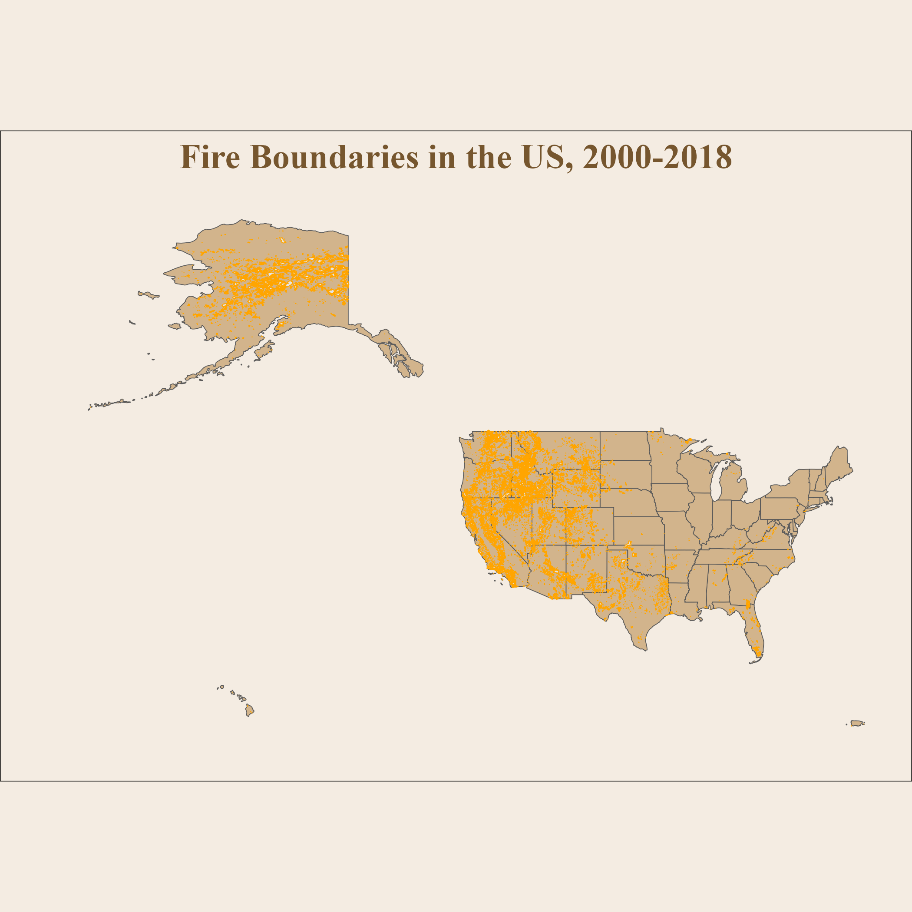

## caRtography
R map commentary

## QGIS
I created this choropleth map in QGIS using data from the Chicago Data Portal, Community Data Snapshot summarized to Community Areas from CMAP, and Open StreetMap. It demonstrates a cohesive, pleasant color scheme and use of multiple types of data, including coordination of points, lines, and polygons to communicate information about the relationship between population, roads, and school locations in Chicago.

I created this map in QGIS using Natural Earth data. It includes an inset map to give context of the detailed map within the entire state of California.

