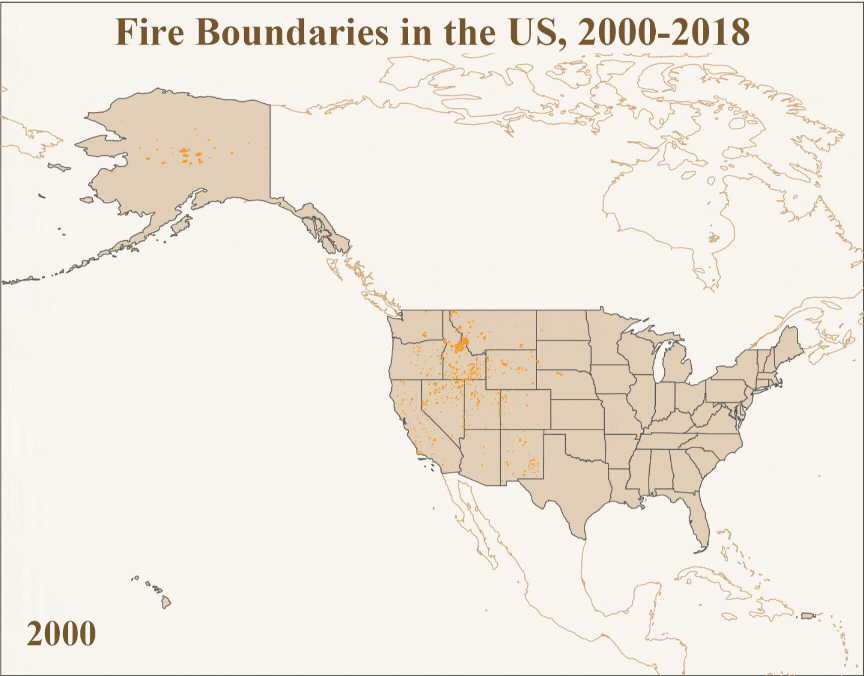
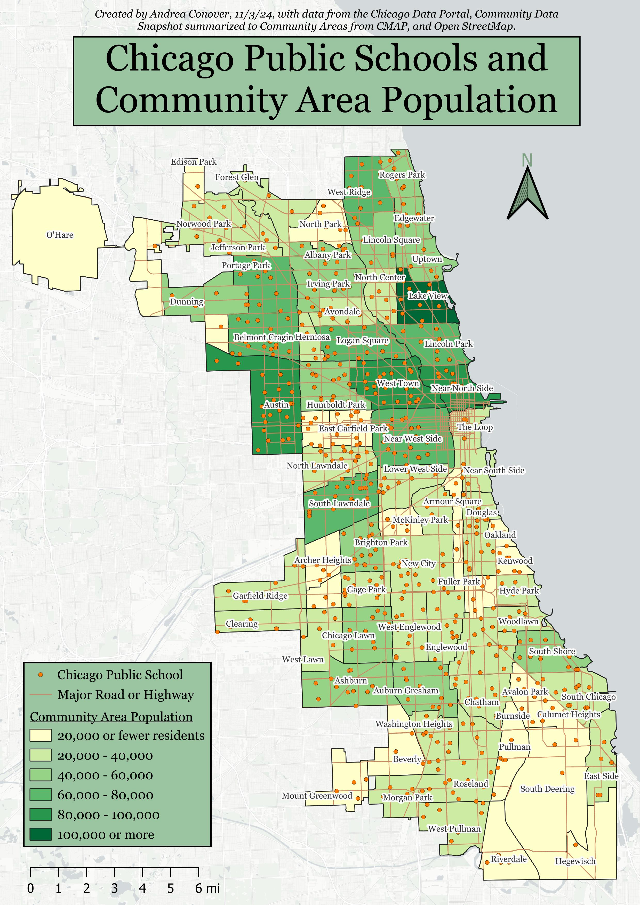
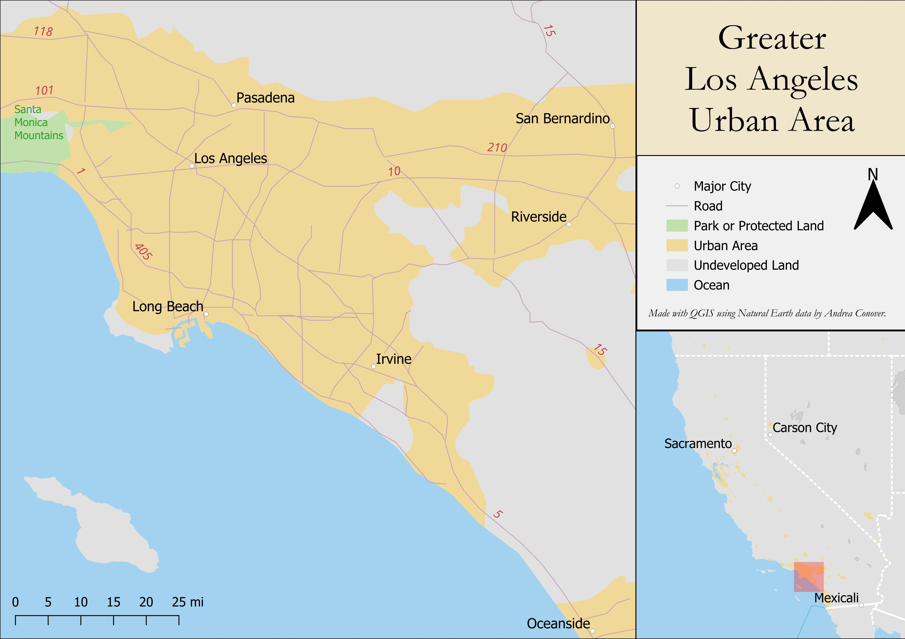

## Tableau
This Tableau dashboard enables users to explore data from Inside Airbnb about listings in Los Angeles in 2024. Because of the highly spatial nature of the data, I centered an interactive map in the dashboard and linked all other interactive elements to it. I also kept a much simpler color scheme in favor of communicating information through size and location instead. This was particularly helpful given the skewed distribution of the data, which meant that traditional color scales were rather uninformative.
<iframe src="https://public.tableau.com/views/AirBnBLocationsinLosAngeles/Dashboard1?:language=en-US&:sid=&:redirect=auth&:display_count=n&:origin=viz_share_link:showVizHome=no&:embed=true" width="1005px" height="845px"></iframe>

## R
I generated this mape of fire boundaries in the US from 2000-2018 in R. I integrated shape files from multiple data sources (including reprojecting them into a matching projection) and chose an aesthetically pleasing and thematically appropriate color scheme.

Data: Fire perimeter data is the "Historic Geomac Perimeters All Years 2000 2018 gdb" dataset from the National Interagency Fire Center, downloaded from https://data-nifc.opendata.arcgis.com/datasets/5b3ff19978be49208d41a9d9a461ecfb/about on in February 2025. The shapefile used for the background map of the states are from the US Census Bureau, downloaded from https://www.census.gov/geographies/mapping-files/time-series/geo/carto-boundary-file.html, also accessed in February 2025. Finally, the coastal shapefiles are from Natural Earth at https://www.naturalearthdata.com/downloads/50m-physical-vectors/50m-coastline/, accessed in March 2025.

## QGIS
I created this choropleth map in QGIS using data from the Chicago Data Portal, Community Data Snapshot summarized to Community Areas from CMAP, and Open StreetMap. It demonstrates a cohesive, pleasant color scheme and use of multiple types of data, including coordination of points, lines, and polygons to communicate information about the relationship between population, roads, and school locations in Chicago.

I created this map in QGIS using Natural Earth data. It includes an inset map to give context of the detailed map within the entire state of California.

