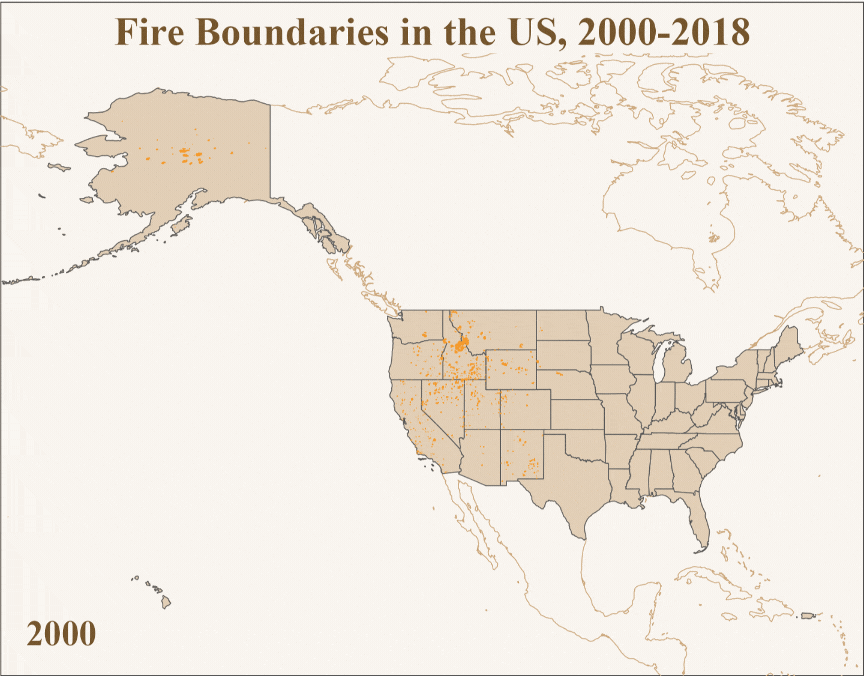

# Mixed Methods Social Scientist
I'm currently an MA candidate at the University of Chicago in the Social Sciences, currently on track for degree completion in early June, 2025. My thesis, "Competing Discourses in News Coverage of the 2024 Bridge Fire", examines conflicts of sensationalism vs. rationalism and human dominance vs. untameable nature in the coverage of southern California wildfires.

## Research Interests
My research interests revolve around human-environment interactions, particularly perceptions of wildland-urban interfaces as expressed through language. I have six years of professional experience writing, teaching, and project managing.

## Want to Learn More?
See ["About"](https://andreaconover.github.io/about.html) for more details of my teaching and work experience!

# Projects
Looking for **animated or interactive data visualizations** and a **web app**? Check out my [Exploring Climate Change Communications](https://andreaconover.github.io/exploringclimatecoms.html) project.

Looking for **maps and interactive data dashboards**? Check out my [Cartography](https://andreaconover.github.io/cartography.html) projects for maps created using R, QGIS, and Tableau.

Want just a quick glimpse of my **data visualization** work? Here's a sample **data dashboard** I developed to enable users to explore the Social Security Administration's public data about baby names from 2023. I emphasized visual appeal through a fun, non-traditional color scheme and a variety of visualization types that each expressed a unique aspect of the dataset.
<iframe src="https://public.tableau.com/views/BabyNamesof2023/BabyNamesDashboard?:language=en-US&:sid=&:redirect=auth&:display_count=n&:origin=viz_share_link:showVizHome=no&:embed=true" width="1005px" height="845px"></iframe>